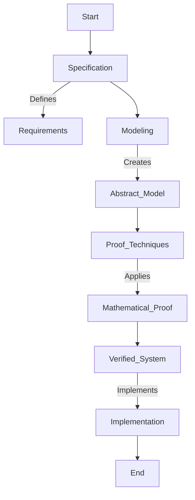
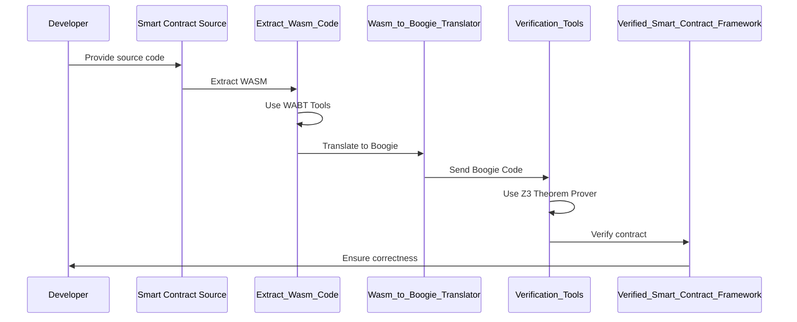
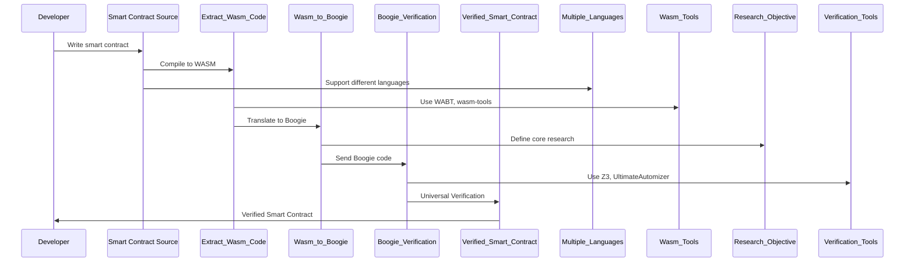

# Wasm2Boogie
A universal translator from WebAssembly (Wasm) to Boogie, enabling formal verification of smart contracts across multiple blockchain platforms.

# 0. General Objective and Background

This chapter presents the overall goal of the internship project and provides all necessary background to understand its significance.

---

## 0.1 Objective of the Internship

**Goal:**  
Develop a translator that converts WebAssembly (Wasm) code into Boogie code. This translator is the core component of a broader framework that will:
- Accept any smart contract (regardless of the underlying blockchain technology).
- Extract its Wasm code using existing tools.
- Convert the Wasm code into Boogie : an intermediate verification language.
- Leverage the powerful Boogie ecosystem to perform rigorous formal verification.

**Value Added:**  
- **Universality:** Many blockchain platforms compile to or use Wasm. By targeting Wasm instead of a specific smart contract language (like Solidity), the framework becomes applicable to a wide variety of blockchain systems.
- **Enhanced Trust:** Formal verification provides mathematical guarantees that a smart contract behaves as intended, reducing risks of vulnerabilities that can lead to severe financial losses.
- **Research Impact:** Success in this project could lead to publication of new methods in formal verification and serve as a foundation for future advances in blockchain security.

---

## 0.2 Background Concepts

### Formal Verification
**Definition:**  
Formal verification uses mathematical techniques to prove that a system meets its specification. Instead of testing a limited number of cases, it examines all possible behaviors.

**Benefits:**
- **Reliability:** Ensures the system behaves correctly under every possible scenario.
- **Safety:** Critical in high-stakes applications (e.g., aerospace, medical devices, financial systems).
- **Security:** Prevents vulnerabilities by rigorously analyzing system properties.

**Diagram – Formal Verification Process:**

---

### Blockchain and Smart Contracts

**Blockchain:**  
A decentralized, distributed ledger technology that records transactions across a network of computers. Key features include:
- **Decentralization:** No single controlling entity.
- **Immutability:** Once data is recorded, it cannot be easily altered.
- **Transparency and Security:** Cryptographic methods ensure secure and verifiable transactions.

**Types of Blockchains:**

| Blockchain Type   | Key Characteristics                           | Examples                          |
|-------------------|-----------------------------------------------|-----------------------------------|
| **Public**        | Open and permissionless; anyone can participate. | Bitcoin, Ethereum                |
| **Private**       | Controlled by a single organization; limited access. | Hyperledger Fabric, Quorum       |
| **Consortium**    | Controlled by a group of organizations.         | R3 Corda, Energy Web Foundation  |

**Smart Contracts:**  
Self-executing programs stored on a blockchain that automatically enforce rules and agreements. They can be written in various languages and, increasingly, compiled to Wasm.

**Types of Smart Contracts:**

| Contract Type            | Description                                               | Typical Platforms         |
|--------------------------|-----------------------------------------------------------|---------------------------|
| **Financial Contracts**  | Handle payments, auctions, and escrows.                   | Ethereum, EOS             |
| **Governance Contracts** | Implement voting and decision-making processes.           | Tezos, Cardano            |
| **Supply Chain Contracts**| Track goods and verify authenticity.                     | VeChain, IBM Food Trust   |
| **Decentralized Apps (DApps)** | Provide various services from games to social media.  | Ethereum, Polkadot        |

---

### Boogie and Its Ecosystem

**What is Boogie?**  
Boogie is an intermediate verification language used as a bridge between high-level code and automated theorem provers. It allows the encoding of program logic and verification conditions in a form that can be automatically checked.

**Advantages of Boogie:**
- **Modularity:** Breaks down complex programs into manageable verification tasks.
- **Automation:** Interfaces with tools like Z3 to automatically discharge proofs.
- **Extensibility:** Widely used in both academic research and industry projects (e.g., VeriSol for Solidity).
- **Community and Ecosystem:** A mature ecosystem that supports advanced verification techniques, making it an ideal target for translating Wasm code.

---

## 0.3 The Existing Landscape

**Existing Tools:**
- **VeriSol:**  
  A tool that translates Solidity smart contracts into Boogie code for formal verification.  
  **Limitation:**  
  Only supports Solidity, restricting its applicability to blockchains that use this language.
  
- **SMARTPULSE :**  
  Focuses on verifying temporal properties (both safety and liveness) of smart contracts.  
  **Limitation:**  
  Tailored to specific contract languages and execution models.

**The Gap:**  
- Many blockchain platforms use WebAssembly (Wasm) as their common target.  
- There is currently no universal tool that converts Wasm code from various smart contract languages into Boogie for formal verification.

**Table – Comparison of Verification Tools:**

| Tool         | Supported Language(s) | Strengths                          | Limitations                           |
|--------------|-----------------------|------------------------------------|---------------------------------------|
| VeriSol      | Solidity              | Proven formal verification on Ethereum | Limited to Solidity-based contracts    |
| SMARTPULSE   | Solidity (with extensions) | Verifies temporal properties, including liveness | Requires custom specifications, limited to certain Solidity features |
| **Proposed Framework** | Any contract compiling to Wasm | Universal applicability across blockchain platforms; leverages Boogie’s strengths | Currently under development; research prototype stage |

---

## 0.4 The Proposed Framework

At the end of the internship, our framework will:

1. **Extract Wasm Code:**  
   Use existing tools (e.g., WABT, wasm-tools) to obtain the Wasm code from smart contracts, regardless of the high-level language they were written in.

2. **Translate Wasm to Boogie:**  
   The main objective is to design a translator that converts the Wasm Abstract Syntax Tree (AST) into an equivalent Boogie representation. This translation will preserve the semantics of the original contract, including its control flow and memory operations.

3. **Perform Formal Verification:**  
   Once translated, the Boogie code will be analyzed using Boogie’s ecosystem (e.g., Z3, UltimateAutomizer) to formally verify the correctness of the smart contract against its specifications.

**Framework Diagram:**



**Key Points:**
- **Universal Verification:** By targeting Wasm, the framework is not tied to any one blockchain platform.
- **Robustness:** Leveraging Boogie’s mature verification tools provides high confidence in the correctness of smart contracts.
- **Innovation and Research:** This approach fills a gap in the current ecosystem and offers significant potential for academic publication.

---

## 0.5 Summary and Impact

**Summary:**  
This internship project aims to build a universal formal verification framework for blockchain smart contracts by translating Wasm code into Boogie. The project addresses a major limitation in current verification tools (e.g., VeriSol) by supporting a broader range of blockchain platforms and smart contract languages. Through rigorous formal methods, the framework will ensure that smart contracts operate correctly and securely, thus fostering greater trust in blockchain systems.

**Impact:**  
- **Academic Contribution:** The research could lead to new publications and advance the field of formal verification.
- **Industrial Relevance:** Enhanced verification of smart contracts will help prevent costly bugs and vulnerabilities, promoting safer blockchain applications.
- **Long-Term Vision:** A final framework capable of verifying any smart contract—irrespective of its origin—will set a new standard for blockchain security and reliability.

---

## 0.6 Additional Statistics and Diagrams (Illustrative)

**Statistics on Blockchain Usage:**  
- Approximately **72.9%** of high-activity contracts on Ethereum follow the ERC20 standard.
- Multiple blockchain platforms (e.g., Ethereum, Polkadot, Tezos) are increasingly using Wasm as a compilation target.

**Table – Overview of Blockchain Platforms and Their Smart Contract Languages:**

| Blockchain Platform | Primary Smart Contract Language | Compilation Target | Notable Features                |
|---------------------|---------------------------------|--------------------|---------------------------------|
| **Ethereum**        | Solidity                        | EVM (but moving towards Wasm) | Largest ecosystem, mature tools |
| **Polkadot**        | Ink!, Rust-based contracts       | WebAssembly        | High performance, scalability  |
| **Tezos**           | Michelson                        | Michelson (custom VM) | Formal verification-friendly   |
| **NEAR Protocol**   | AssemblyScript, Rust             | WebAssembly        | Developer-friendly, fast       |
| **EOSIO**           | C++                             | WebAssembly        | High throughput, resource management |

**Diagram – End-to-End Framework Overview:**



## 1. References  

- **Wasm-verify tool** : [GitHub](https://github.com/DavidMazarro/wasm-verify) (code Haskell)  
- **WebAssembly Documentation** : [MDN](https://developer.mozilla.org/en-US/docs/WebAssembly/Guides/Concepts)
- **WebAssembly Book** : [Official Book](https://webassembly.github.io/spec/core/_download/WebAssembly.pdf)
- **Boogie Documentation** :  
  - [Boogie PDF](https://www.microsoft.com/en-us/research/wp-content/uploads/2016/12/krml178.pdf)  
  - [Boogie Docs](https://boogie-docs.readthedocs.io/en/latest/)
- **Other Documentation** :
   - [Verisiol Microsoft](https://www.microsoft.com/en-us/research/wp-content/uploads/2019/09/vstte_camera_ready.pdf)
   - [Smart pulse](https://bmarwritescode.github.io/assets/pdf/smartpulse.pdf)
      
## 2. Understanding Wasm  

### 2.1 What is WebAssembly (Wasm)?  
WebAssembly (Wasm) is a low-level binary instruction format designed for efficient execution in web browsers and other runtime environments. It provides a portable compilation target for languages such as C, C++, and Rust, enabling near-native performance while ensuring security and platform independence.  

**Key characteristics of WebAssembly:**  
- **Binary format**: Compact and efficient representation for fast loading and execution.  
- **Stack-based execution**: Uses an operand stack for computation rather than registers.  
- **Linear memory model**: Direct memory access through a contiguous address space.  
- **Security & sandboxing**: Designed to run safely in a restricted execution environment.  
- **Platform-independent**: Can run on any machine with a WebAssembly runtime.  

### 2.2 Core Concepts of Wasm  
#### 2.2.1 Instructions  
- Wasm instructions are stack-based and operate on a linear memory model.  
- Example categories:  
  - **Arithmetic**: `i32.add`, `f64.mul`  
  - **Memory operations**: `i32.load`, `i32.store`  
  - **Control flow**: `if`, `else`, `br`, `loop`  

#### 2.2.2 Control Flow  
- Wasm supports structured control flow constructs:  
  - **Blocks**: Used for scoping and organizing execution.  
  - **Loops**: Executed with `loop` and can be exited with `br`.  
  - **Conditional Branching**: Handled via `if`, `else`, and `br_if`.  

#### 2.2.3 Memory Management  
- Uses a linear memory model, allocated as contiguous blocks.  
- Memory is accessed using `load` and `store` instructions.  
- Supports dynamic memory growth using `memory.grow`.  

#### 2.2.4 Function Calls  
- Functions are first-class citizens in Wasm.  
- Parameters and return values follow a strict type system.  
- Supports indirect function calls via tables for dynamic dispatch.  

### 2.3 Wasm Execution Model  
 The Wasm runtime executes instructions in a stack-based manner.  
The execution state consists of:  
- **Operand stack**: Stores temporary computation results.
- **Control stack**: Maintains function calls and control flow structures.
- **Linear memory**: Stores data globally accessible to functions.
- **Global variables:** Hold persistent values.
- Tables: Store function references for indirect calls.

### 2.4 Wasm Module Structure  
A Wasm module consists of multiple sections defining its behavior:  

| Section    | Description                               |
|------------|-------------------------------------------|
| **Type**   | Defines function signatures.             |
| **Import** | Declares external functions, memory, or tables. |
| **Function** | Contains function definitions.          |
| **Table**  | Holds function pointers for indirect calls. |
| **Memory** | Defines the linear memory layout.        |
| **Global** | Stores global variables.                 |
| **Export** | Exposes functions and memory for external use. |
| **Code**   | Contains compiled function bodies.       |
| **Data**   | Stores initialized memory data.         |


  ### 2.5 Why Translate Wasm to Boogie?  
- **Formal Verification**: Ensure correctness of Wasm programs.  
- **Bug Detection**: Catch undefined behaviors and memory violations.  
- **Optimization and Analysis**: Understand program properties before execution.

---


## 3. Understanding Boogie  

Boogie is an intermediate verification language developed by Microsoft Research. It serves as a foundational layer for formal verification of programs by providing a simple and expressive language for modeling program logic and reasoning about correctness properties.

### 3.1 What is Boogie?  
Boogie is designed to facilitate program verification by translating high-level languages into a structured intermediate representation that can be analyzed using theorem provers like Z3. It provides constructs for:  
- **Procedures and Functions**: Representing program logic.  
- **Assertions and Assumptions**: Defining correctness conditions.  
- **Control Flow Structures**: Modeling loops, conditionals, and function calls.  
- **Memory Modeling**: Using arrays to represent heap and stack memory. 

### 3.2 Key Features of Boogie  

#### 3.2.1 Variables and Types  
Boogie supports a simple type system:  
- **int**: Represents integer values.  
- **bool**: Represents boolean values.  
- **real**: Represents floating-point values.  
- **Arrays**: Used to model memory, stacks, and data structures.  

Example:  
```boogie
var x: int;
var y: bool;
var mem: [int]int;
```

#### 3.2.2 Procedures and Contracts  
Boogie programs consist of **procedures**, which can have preconditions and postconditions.  

Example:  
```boogie
procedure Add(a: int, b: int) returns (sum: int)
requires a >= 0 && b >= 0;
ensures sum == a + b;
{
    sum := a + b;
}
```
- **requires**: Defines preconditions that must be satisfied before execution.
- **ensures**: Specifies postconditions that must hold after execution.

#### 3.2.3 Assertions and Assumptions  
Assertions and assumptions help in proving program correctness.  

- **assert**: Ensures a condition holds; otherwise, verification fails.  
- **assume**: Assumes a condition is true for further reasoning.  

Example:  
```boogie
procedure Example(x: int)
{
    assume x > 0;
    assert x + 1 > x;
}
```

#### 3.2.4 Control Flow Structures  
Boogie supports conditionals and loops:  

```boogie
procedure LoopExample(n: int) returns (sum: int)
requires n >= 0;
ensures sum >= 0;
{
    var i: int;
    sum := 0;
    i := 0;
    while (i < n)
    invariant sum >= 0 && i >= 0;
    {
        sum := sum + i;
        i := i + 1;
    }
}
```

- **while** (condition): Defines loops.
- **invariant**: Ensures correctness of loops.
## 4. Defining the Translation Framework

The translation from Wasm to Boogie requires a structured approach to ensure correctness and maintainability.

### 4.1 Translation Objectives

- **Preserve Semantics**: Ensure that Wasm instructions maintain their intended behavior in Boogie.
- **Type Safety**: Properly map Wasm types (`i32`, `i64`, etc.) to Boogie types.
- **Stack Management**: Simulate Wasm's stack-based execution model within Boogie.
- **Control Flow Handling**: Convert structured control flow (`if`, `loop`, `block`, `br`) to Boogie constructs.

### 4.2 Translation Context

A translation context is essential for tracking variable bindings, type information, and execution state.

- **Local Variables**: Wasm function locals are mapped to Boogie variables.
- **Execution Stack**: An explicit stack model can be introduced in Boogie.
- **Label Mapping**: Control flow labels must be correctly translated to Boogie assertions and jumps.

### 4.3 Type Correspondence Between Wasm and Boogie

| Wasm Type | Boogie Equivalent |
|-----------|------------------|
| `i32`     | `int`            |
| `i64`     | `int` (with extended handling) |
| `f32`     | `real`           |
| `f64`     | `real`           |

### 4.4 Stack Representation

Since Boogie does not use an explicit stack, we need an approach to simulate stack behavior:

- Use an array `Stack: [int] int` to represent stack elements.
- Maintain a `StackPointer` variable to track the top of the stack.
- Model `push` and `pop` operations using `Stack[StackPointer] := value`.

### 4.5 Control Flow Representation

- **Basic Blocks**: Boogie supports structured control flow using procedures and assertions.
- **Branching (`br`, `if`, `loop`)**:
  - Convert `br` to Boogie `goto` statements.
  - Convert `if` conditions to `if` statements with `assume` or `assert`.

### 4.6 Memory Representation

- Use a Boogie array `Memory: [int] int` to simulate Wasm's linear memory.
- Model `load` and `store` instructions as array accesses:
  ```boogie
  Memory[address] := value; // store
  value := Memory[address]; // load
`
### 4.7 Verification and Correctness
To guarantee correctness, assertions and invariants are introduced:

- **Type Safety**: Ensure that operations respect type constraints.
Stack Bounds: Prevent stack overflows and underflows.
- **Memory Safety**: Ensure valid memory accesses.
 
# 5. Work Roadmap  

The development of the **Wasm → Boogie** compiler follows a structured approach to ensure correctness and efficiency. The main steps are:  

1. **Choosing the Programming Language**: Conducting a comparative study of different languages to select the most suitable one for compiler development.  
2. **Extracting the Abstract Syntax Tree (AST) from Wasm (.wat) Code**: Parsing WebAssembly textual format to generate an AST representation.  
3. **Defining Transformation Rules from Wasm AST to Boogie AST**: Establishing a set of formal translation rules to map WebAssembly constructs to Boogie.  
4. **Generating Boogie Code from Boogie AST**: Implementing the final translation step to produce verifiable Boogie code.  

Each of these steps ensures a systematic transformation from WebAssembly to Boogie while preserving correctness and verifiability.  

---
